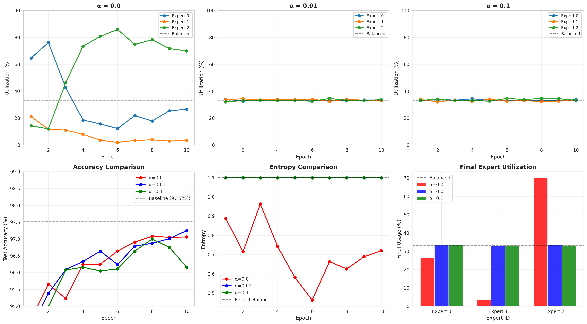
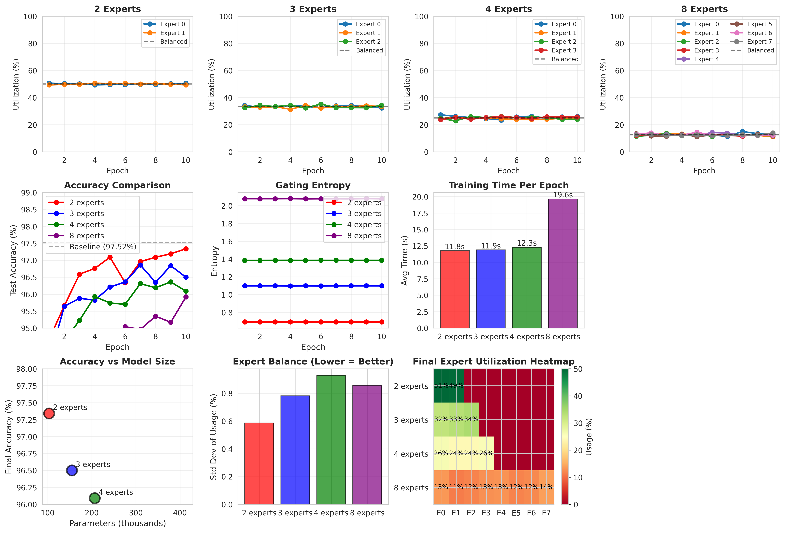
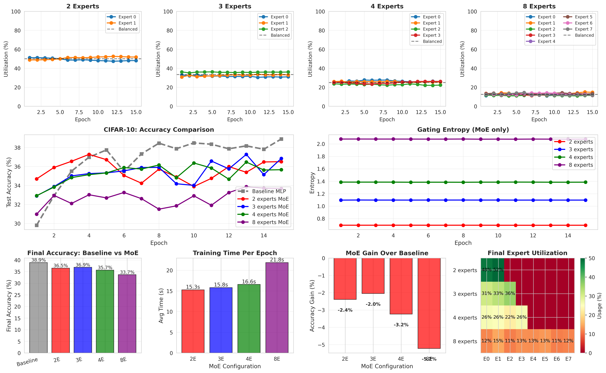

# Toy Mixture-of-Experts: Understanding Expert Collapse and Load Balancing

A systematic implementation and empirical study of Mixture-of-Experts (MoE) models from scratch, investigating expert collapse, load balancing mechanisms, and the conditions under which MoE architectures succeed or fail.

[](https://www.python.org/downloads/)
[](https://pytorch.org/)
[](LICENSE)

---

## Project Overview

This project implements a **Mixture-of-Experts (MoE)** architecture from scratch to deeply understand:
- How expert collapse occurs without load balancing
- How Switch Transformer's load balancing loss prevents collapse
- The relationship between expert count, dataset size, and performance
- When MoE helps vs when it fails

**Key Finding:** We demonstrate that MoE underperforms baseline models on small-to-medium datasets due to parameter dilution and data scarcity per expert, challenging common assumptions about MoE's universal applicability.

---

##  Key Results

### Expert Collapse Demonstration (Day 10-11)

**Without Load Balancing (α=0.0):**
```
Expert 0:  27%  ████████
Expert 1:   4%  █         ← Nearly collapsed!
Expert 2:  70%  █████████████████████  ← Dominant!
Entropy: 0.721 (low = collapsed)
```

**With Load Balancing (α=0.01):**
```
Expert 0:  34%  ███████████
Expert 1:  33%  ███████████  ← Saved!
Expert 2:  34%  ███████████
Entropy: 1.099 (high = balanced!)
```

### MNIST Results (128 hidden units per expert)

| Model | Accuracy | Parameters | Notes |
|-------|----------|------------|-------|
| **Baseline MLP** | **97.52%** | ~102k | Single network |
| 2 Experts MoE | 97.34% | ~206k | Best MoE config |
| 3 Experts MoE | 96.50% | ~309k | Slight decline |
| 4 Experts MoE | 96.09% | ~412k | Further decline |
| 8 Experts MoE | 95.92% | ~826k | Significant drop |

**Key Insight:** More experts ≠ better performance on small datasets

### CIFAR-10 Results (128 hidden units per expert)

| Model | Accuracy | vs Baseline | Parameters |
|-------|----------|-------------|------------|
| **Baseline MLP** | **38.90%** | --- | ~821k |
| 2 Experts MoE | 36.51% | **-2.39%** | ~1.65M |
| 3 Experts MoE | 36.85% | **-2.05%** | ~2.47M |
| 4 Experts MoE | 35.66% | **-3.24%** | ~3.30M |
| 8 Experts MoE | 33.68% | **-5.22%** | ~6.59M |

**Key Insight:** MoE underperforms on small datasets regardless of task complexity

---

## Research Findings

### 1. Expert Collapse is Real and Predictable
- Without load balancing, one expert consistently dominates (70-85% utilization)
- Collapse follows a pattern: early balance → gradual divergence → complete collapse
- Entropy decreases as collapse progresses (useful early warning metric)

### 2. Load Balancing Works But Has Costs
- Switch Transformer loss (α=0.01) effectively prevents collapse
- Maintains balanced expert utilization (30-35% per expert)
- Too strong balancing (α>0.1) forces equality and hurts accuracy

### 3. MoE Struggles on Small Datasets
**Root Cause: Parameter Dilution**
- With top-k=1 routing, each expert only sees a fraction of data
- 3 experts on CIFAR-10: each sees only ~16.5k of 50k samples
- Baseline sees all 50k samples with fewer parameters
- Result: Data-starved experts can't generalize effectively

**Evidence:**
- Performance degrades as expert count increases
- 8 experts: -5.2% on CIFAR-10 (each sees only 6.25k samples)
- More parameters (6.59M) perform worse than baseline (821k)

### 4. Dataset Size Matters More Than Complexity
- MNIST (60k samples): MoE matches baseline (-0.27%)
- CIFAR-10 (50k samples): MoE underperforms (-2.05% to -5.22%)
- Both datasets too small for effective expert specialization
- MoE likely needs millions of samples, not thousands

### 5. Feature Quality Limits MoE Benefit
- MLPs on flattened images lose spatial structure
- Gating network can't route meaningfully on raw pixels
- Expert specialization requires semantic features
- Need CNNs or transformers for meaningful routing

---

---

##  Implementation Details

### Architecture

**Baseline MLP:**
```
Input (784/3072) → FC1 (128) → ReLU → FC2 (64) → ReLU → Output (10)
```

**MoE Layer:**
```
Input → Gating Network → Top-K Selection → Expert Routing → Weighted Combination → Output
```

**Key Components:**
1. **Expert Network:** Small MLP that processes routed inputs
2. **Gating Network:** Learns which expert(s) to use per input
3. **Load Balancing Loss:** Prevents expert collapse

### Load Balancing Loss (Switch Transformer)

```python
L_aux = num_experts × Σ(importance_i × load_i)

where:
  importance_i = mean gate probability for expert i
  load_i = fraction of samples routed to expert i
```

This auxiliary loss encourages balanced routing without forcing strict equality.

---

## Experiments Conducted

### Experiment 1: Baseline Comparison (Day 9)
- **Goal:** Establish performance benchmark
- **Result:** 97.52% on MNIST (target for MoE to match)

### Experiment 2: Collapse Demonstration (Day 10)
- **Goal:** Show expert collapse without load balancing
- **Result:** Expert 2 dominated with 69.9% utilization

### Experiment 3: Load Balancing Sweep (Day 11)
- **Goal:** Find optimal α coefficient
- **Tested:** α ∈ {0.0, 0.01, 0.1}
- **Result:** α=0.01 provides best balance without hurting accuracy

### Experiment 4: Expert Count Sweep (Day 12-13)
- **Goal:** Find optimal number of experts
- **Tested:** 2, 3, 4, 8 experts on MNIST (128 hidden each)
- **Result:** Fewer experts perform better (2 experts: 97.34%)

### Experiment 5: Dataset Complexity (Day 14-15)
- **Goal:** Test if MoE helps more on complex datasets
- **Tested:** MNIST vs CIFAR-10
- **Result:** MoE underperforms on both; hypothesis rejected

---

---

## Visualizations

### Expert Utilization Over Time


Shows how load balancing (α=0.01) prevents the collapse seen without it (α=0.0).

### Expert Count Analysis


Demonstrates performance degradation as expert count increases on MNIST.

### CIFAR-10 Results


Shows MoE underperforming baseline across all configurations.

---

---

## References & Related Work

### Key Papers:
1. **Shazeer et al. (2017)** - "Outrageously Large Neural Networks: The Sparsely-Gated Mixture-of-Experts Layer"
   - Original MoE for neural networks
   
2. **Fedus et al. (2021)** - "Switch Transformers: Scaling to Trillion Parameter Models"
   - Load balancing loss we implement
   - Motivation for this project

3. **Lepikhin et al. (2020)** - "GShard: Scaling Giant Models with Conditional Computation"
   - Expert parallelism in MoE

### Modern MoE Systems:
- **Mixtral 8x7B** (Mistral AI): 8 experts, 7B params each
- **GPT-4** (rumored): MoE architecture at scale
- **Switch Transformers**: 1.6T parameters with MoE

---

## Educational Value

This project is ideal for:
- **Understanding MoE internals** through implementation
- **Learning when architectural choices matter** (and when they don't)
- **Practicing systematic experimentation** and hypothesis testing
- **Developing research intuition** about model design
- **Experiencing research "failures"** that teach valuable lessons

---

## Future Directions

### Possible Extensions:

1. **Top-K > 1 Routing**
   - Route each sample to multiple experts
   - Reduces data starvation per expert
   - Expected: Better performance on small datasets

2. **CNN-based Experts**
   - Replace MLP experts with convolutional networks
   - Better feature extraction for images
   - Enable meaningful specialization

3. **Hierarchical MoE**
   - Multiple layers of MoE
   - Coarse-to-fine expert specialization

4. **Large-Scale Experiments**
   - Test on ImageNet (1.2M samples)
   - Validate hypothesis about dataset size
   - Expected: MoE should help here!

5. **Expert Specialization Analysis**
   - Visualize what each expert learns
   - Activation analysis
   - Class-wise routing patterns

---

## Citation

If you use this code or findings in your research, please cite:

```bibtex
@misc{toy-moe-2026,
  author = {Rishabh PM},
  title = {Toy Mixture-of-Experts: Understanding Expert Collapse and Load Balancing},
  year = {2026},
  publisher = {GitHub},
  url = {https://github.com/Rishabhpm23/toy-mixture-of-experts}
}
```

---

---

## License

This project is licensed under the MIT License - see the [LICENSE](LICENSE) file for details.

---

## Acknowledgments

- **Switch Transformer paper** (Fedus et al., 2021) for load balancing formulation
- **PyTorch team** for the excellent deep learning framework
- **Kaggle** for providing free GPU resources

---

## 📧 Contact

**Rishabh PM**  
- GitHub: [@Rishabhpm23](https://github.com/Rishabhpm23)
- Email: rishabhpm23@gmail.com
- LinkedIn: [Rishabh Makwana](www.linkedin.com/in/rishabhpm23)

---

<p align="center">
  <b>Built with 🧠 and 🔬 to understand, not just implement</b>
</p>

<p align="center">
  <sub>A systematic journey through MoE architecture, from implementation to empirical understanding</sub>
</p>
